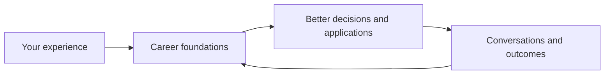

# Trajectory

**A career workspace that helps you organize your career history, find decent opportunities, and communicate.**

Download the ZIP, unzip it, and open the extracted folder in your preferred AI agent.

Trying to remember every little thing about your career all at once can be hard. Trying to curate the right parts into a CV can be hard. Trawling job boards and interacting with application processes is exhausting. Trajectory is meant to take all that off your hands. You go through an initial "onboarding", which is basically a data-dump of your career history. From there, Trajectory can look for opportunities for you and apply to them also. It will come back to you with opportunities it has identified as being good for you. You can say which ones you like, and it can prepare tailored CVs, cover letters, etc. for each and send them off. It records all ongoing opportunities in the opportunities directory. That way you can manage a high volume of opportunities simultaneously. The goal here is not to spam the job market. Trajectory is supposed to actually help you filter out bad opportunities, prevent you from wasting your time with bad fits, and basically try to prevent you from becoming drained by the whole job hunt experience. The opportunities folder helps prevent us from applying to the same job twice, and also remembers correspondence to make follow ups or refreshers easy. One use case is right before a screening call, you can say that you have the call coming up, and it will tell you about the company, why it is a good fit, answers to prepare, etc. It can even help when it comes to the offer stage.

Trajectory helps you organize long stories, impressive experiences, and awkwardly worded preferences, alongside what makes you tick and what you want next. That understanding gives your AI agent something useful to work with: a profile it can use to help find and assess suitable opportunities, then tailor CVs and cover letters for each one. With access to web search or connected job sources, it can look for roles that fit your experience, ambitions, and preferred working environment.

Applications may share most of the same content. The useful difference is knowing which accurate details deserve more emphasis for a particular role: a project you nearly forgot, someone you helped develop, or a problem you handled that turns out to be especially relevant. Trajectory keeps that evidence available, so tailoring stays grounded in what you actually did.

Clone or download this project, open it in your preferred AI agent, and build a living collection of your experience, evidence, preferences, and opportunities. Life is short, so make the most of it: advocate for better compensation and meaningful work, search for good colleagues and room to grow, and point yourself in a direction you actually want to take.

## Start here

1. [Download the ZIP](https://github.com/goughjo02/Trajectory/archive/refs/heads/main.zip) and unzip it (or clone the repository if you prefer). Open the extracted project folder in an agent such as Codex or Claude Code that can read and edit local files.
2. Ask it to run **initialise-workspace**. In Claude Code or Codex, use `/initialise-workspace`.
3. The agent will first offer a jump start from existing material: your LinkedIn profile, CVs, cover letters, website, portfolio, or rough notes. Share links, files, or pasted text—or simply start talking. There is nothing you need to prepare.

If your agent does not discover the skill, paste this:

> Read AGENTS.md, then read and follow .agents/skills/initialise-workspace/SKILL.md to help me start or resume my career foundations. Check existing files first.

There is no application server, package installation, or account to create for Trajectory itself. Your chosen agent has its own setup and requirements.

**Note: this is just prompt engineering. Trajectory does not collect anything on you. All the material remains local on your computer (except, of course, that everything goes to your cloud LLM provider).**

## A conversation, at your pace

The onboarding is thorough on purpose. It explores your history, draws out concrete stories, and helps clarify what you want next. You can take breaks, return another day, skip topics, or jump straight into an urgent opportunity.

**Wander**. Add something when it comes to mind. Rough notes, half-remembered examples, and awkward wording are welcome. The agent's job is to sift, distill, and organize, not to judge your delivery.

It first offers to read any existing material, using it to build an initial picture and avoid asking you to repeat the basics. Then it explores your current circumstances, direction, and the useful details behind your experience. Old application wording is a starting point to check and deepen, not assumed to be your current story. For culture and ambitions, it looks for patterns in real examples and checks tentative interpretations with you. This is career support, not a personality assessment.

Progress is saved in [onboarding/progress.md](onboarding/progress.md). The agent is instructed to suggest starting or resuming when appropriate, without blocking other work or repeatedly prompting after you defer. This depends on your harness loading the project instructions; it is not an installed startup hook.

## From memories to useful evidence

| Folder           | What it holds                                                            |
| ---------------- | ------------------------------------------------------------------------ |
| `profile/`       | Direction, ambitions, preferences, working style, culture fit, and voice |
| `experience/`    | Employment, education, independent work, and other relevant experience   |
| `case-studies/`  | Detailed stories of contributions, outcomes, and lessons                 |
| `skills/`        | Your capabilities, evidence, and honest limits                           |
| `evidence/`      | Proof points linked back to their sources                                |
| `documents/`     | Reusable CVs, biographies, and public profile drafts                     |
| `opportunities/` | Each role, its research, correspondence, drafts, and next steps          |
| `onboarding/`    | Interview progress and provisional interpretations                       |
| `changelog/`     | Meaningful memory updates and corrections                                |
| `templates/`     | Starting structures for new records                                      |
| `private/`       | Optional source material excluded from Git by default                    |

These are foundations, not a fixed taxonomy of careers. Adapt them to your work and circumstances.

## Keep the story current

Keep this up to date through your job search for the best results. Up-to-date information helps it make optimum decisions.

Use the workspace for real career conversations. Tell it what changed, what went well, what you learned, and what no longer fits. The agent is instructed to save useful explicit facts and preferences, flag meaningful updates, and check contradictions. Unconfirmed interpretations stay separate from confirmed profile information.

Ask “What have you recorded about me?” or “Update my preferences” at any time. You can also edit the Markdown files yourself.

For each opportunity, feed relevant interactions back into its folder: recruiter messages, interview notes, feedback, decisions, deadlines, and follow-ups. This helps the agent avoid duplicate applications and give advice based on the latest conversation. It cannot know about messages or events you have not supplied or explicitly connected.

Try requests such as:

- “Assess this role against what matters to me, including the trade-offs.”
- “Help me explain my contribution without overstating it.”
- “Prepare interview stories from my experience.”
- “Here is the recruiter's reply. Update the opportunity and draft a response.”

The first release deliberately leaves specialised application workflows relatively unopinionated. It provides rich foundations and working conventions; you and your agent choose the approach that fits the situation.

## Your files, your tools

Trajectory is a collection of local files and instructions. It has no telemetry, hosted service, or automatic uploading. Your agent and model provider still process the context you share under their own settings and agreements. Connected services, remote work environments, and any publishing you request have their own data arrangements.

Career folders are intentionally eligible for Git tracking, so you can keep a useful history. Committing locally does not publish them. Ordinary users cannot push to an upstream repository without write access, but can publish their own copy or fork. If you want remote backups of your personal workspace, use a private repository and check the destination before pushing. The optional `private/` folders are ignored, not encrypted; agents can still read them.

You can ask the agent not to record a detail. If something was already committed, deleting its current file does not remove earlier Git history.

## Bring your preferred agent

The canonical instructions are [AGENTS.md](AGENTS.md), and the interview skill lives in [.agents/skills/initialise-workspace/](.agents/skills/initialise-workspace/SKILL.md).

For Claude Code, `CLAUDE.md` links to `AGENTS.md` and `.claude/skills/initialise-workspace` links to the same skill directory. [Claude Code supports project skills and symlinked skill folders](https://code.claude.com/docs/en/skills). There is one source to maintain.

If your harness uses another convention, copy or link the instructions and skill into its expected location, preserving the skill's `references/` folder. You can always use the explicit prompt above. On systems where a checkout does not preserve symlinks, replace the links with copies of their targets; keep those copies in sync when updating.

Harnesses differ in discovery, permissions, context, and file access. The instructions are portable Markdown; identical behaviour across every agent is not guaranteed.

## Optional integrations

With suitable computer-use tools, an agent may help navigate LinkedIn and other job sites. With an explicitly connected email service, it may help find relevant correspondence and update opportunity records. Availability depends on your tools and account permissions; nothing is connected or configured by this repository.

Research and drafting can support the process. Sending messages, submitting applications, or publishing material needs your instruction. Trajectory does not run background inbox checks or scheduled reminders by itself.

## Make it your own

Use the project as a starting point, improve the prompts, and adapt the structure. Keep contributions to the public starter free of your personal career records.

Created by **Joey Gough**. Shared under the [MIT licence](LICENSE), allowing reuse and modification with the copyright and licence notice retained.
